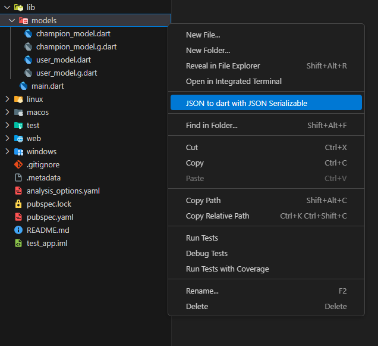
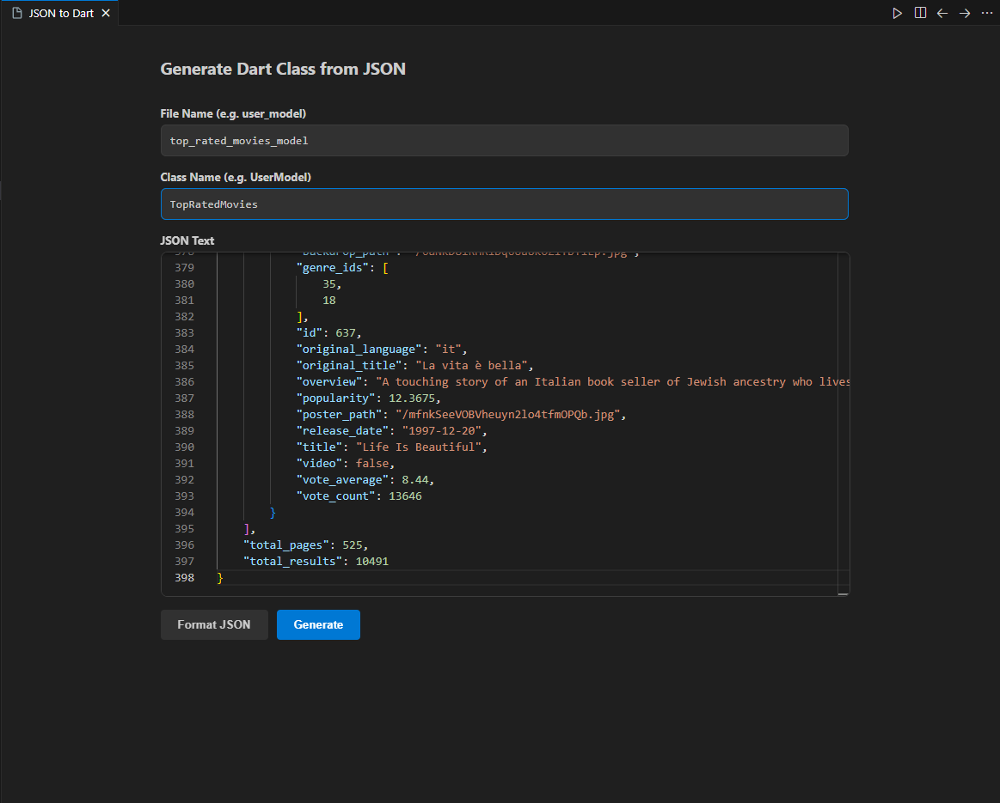

# JSON to Dart (with JSON Serializable) 🚀

Generate robust, type-safe Dart data classes from raw JSON instantly.
Designed for Flutter developers who use **`json_serializable`**, featuring a powerful built-in editor and smart name conflict resolution.


## ✨ Key Features

- **⚡ Instant Generation:** Right-click any folder in your Explorer and generate files immediately.
- **🛠 json_serializable Support:** Generates classes ready for `build_runner`, including:
  - `@JsonSerializable()` annotation.
  - `@JsonKey(name: 'key')` for every field (runtime safety).
  - `fromJson` & `toJson` factory methods.
  - Correct `part 'filename.g.dart';` directive based on file name.
- **🧠 Smart Name Handling:** Automatically resolves name collisions for nested objects using a **Parent Prefixing Strategy** (e.g., `UserStats` instead of duplicate `Stats`).
- **💻 Built-in Monaco Editor:**
  - Full-featured JSON editor (like VS Code).
  - Syntax Highlighting & Error Validation.
  - **Auto-Formatting** button to pretty-print your JSON.
  - Line numbers and folding ranges.
- **🛡️ Null Safety:** Generates modern Dart code with `final` fields and `required` parameters.

---

## 📸 Usage

### 1. Right-click on a target folder

Select **"JSON to dart with JSON Serializable"** from the context menu.



### 2. Enter Details & Paste JSON

A modern editor window will open. Enter your file name, class name, and paste your JSON.
Use the **Format** button to clean up your JSON input.



### 3. Generate!

Click generate, and the extension will create the `.dart` file inside the selected folder.

---

## 📦 Required Dependencies

Since this extension generates code for `json_serializable`, make sure your `pubspec.yaml` has the following dependencies:

```yaml
dependencies:
  json_annotation: ^4.8.0

dev_dependencies:
  build_runner: ^2.4.0
  json_serializable: ^6.7.0
```

Or run this command in your terminal:

```bash
flutter pub add json_annotation
flutter pub add --dev build_runner json_serializable
```

Don't forget to run the builder to generate the .g.dart files:

```bash
flutter pub run build_runner build --delete-conflicting-outputs
```

---

## 📝 Example Output

Input JSON:

```json
{
  "name": "John Doe",
  "age": 30,
  "is_active": true,
  "stats": {
    "score": 100,
    "level": 5
  }
}
```

---

## Generated Dart Code:

```dart
import 'package:json_annotation/json_annotation.dart';
part 'user_model.g.dart';

@JsonSerializable()
class UserModel {
  @JsonKey(name: 'name')
  final String name;
  @JsonKey(name: 'age')
  final int age;
  @JsonKey(name: 'is_active')
  final bool isActive;
  @JsonKey(name: 'stats')
  final Stats stats;

  UserModel({
    required this.name,
    required this.age,
    required this.isActive,
    required this.stats,
  });

  factory UserModel.fromJson(Map<String, dynamic> json) =>
      _$UserModelFromJson(json);

  Map<String, dynamic> toJson() => _$UserModelToJson(this);
}

@JsonSerializable()
class Stats {
  @JsonKey(name: 'score')
  final int score;
  @JsonKey(name: 'level')
  final int level;

  Stats({
    required this.score,
    required this.level,
  });

  factory Stats.fromJson(Map<String, dynamic> json) => _$StatsFromJson(json);

  Map<String, dynamic> toJson() => _$StatsToJson(this);
}
```

---

## 👨‍💻 Author

[Mohamed Osama](https://github.com/MuhamedUssama)

---

## 📄 License

This project is licensed under the MIT License - see the [LICENSE](LICENSE) file for details.
